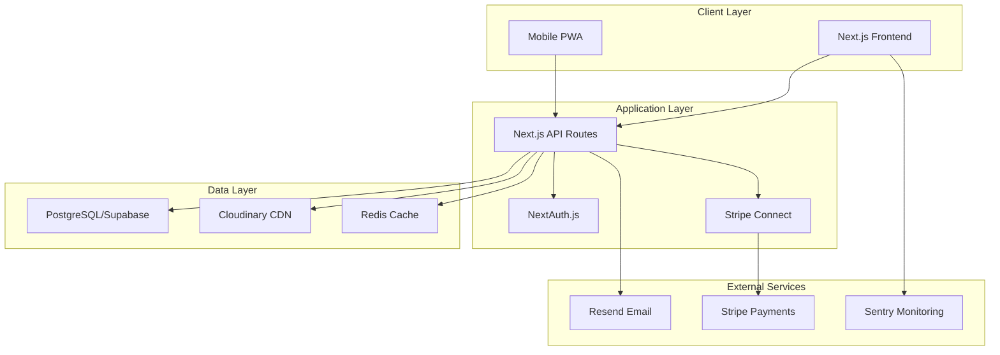

# The Independent Studio

<p align="center">
  <strong>Connecting beauty professionals with dancers at competitions nationwide</strong>
</p>

<p align="center">
  <a href="#features">Features</a> •
  <a href="#tech-stack">Tech Stack</a> •
  <a href="#getting-started">Getting Started</a> •
  <a href="#architecture">Architecture</a> •
  <a href="#contributing">Contributing</a> •
  <a href="#license">License</a>
</p>

<p align="center">
  
  
  
  
  
</p>

## 🎯 Overview

The Independent Studio is a specialized marketplace platform that connects professional beauty stylists with competitive dancers at dance competitions across the country. We're solving the critical challenge dancers face in finding reliable, skilled hair and makeup services at competition venues while providing stylists with a steady stream of bookings and professional business tools.

### The Problem

- **Dancers** struggle to find quality stylists at competition venues, often relying on Facebook groups and word-of-mouth
- **Stylists** lack professional tools to manage bookings, payments, and taxes for their mobile beauty businesses
- **Event organizers** have no centralized system to coordinate beauty services for their competitions

### Our Solution

A comprehensive marketplace platform that provides:

- 🔍 **Smart matching** between dancers and stylists based on location, services, and availability
- 📅 **Intelligent scheduling** with conflict prevention and competition event integration
- 💳 **Secure payments** through Stripe Connect with automated tax reporting
- ⭐ **Trust & safety** through verified profiles, reviews, and professional standards
- 📱 **Mobile-first design** optimized for on-the-go usage at competition venues

## ✨ Features

### For Dancers

- Browse and book verified stylists by competition location
- View portfolios, reviews, and real-time availability
- Secure payment processing with booking protection
- Manage all bookings in one dashboard
- Receive automated reminders and updates

### For Stylists

- Professional business profile with portfolio showcase
- Dynamic pricing with event multipliers
- Automated scheduling and conflict prevention
- Integrated payment processing with 75% payout (25% platform fee)
- Tax reporting compliance (1099-K for US, DAC7 for EU)
- Business analytics and performance insights

### For Event Organizers

- List competitions with venue details
- Coordinate stylist services for participants
- Access to verified professional network
- Event-specific reporting and analytics

## 🚀 Tech Stack

### Frontend

- **Framework**: [Next.js 14.2](https://nextjs.org/) with App Router
- **Language**: [TypeScript](https://www.typescriptlang.org/) with strict mode
- **Styling**: [Tailwind CSS](https://tailwindcss.com/) with custom design system
- **State Management**: React Server Components + Client state
- **Forms**: [React Hook Form](https://react-hook-form.com/) + [Zod](https://zod.dev/) validation

### Backend

- **API**: Next.js API Routes with REST architecture
- **Database**: [PostgreSQL](https://www.postgresql.org/) via [Supabase](https://supabase.com/)
- **ORM**: [Prisma](https://www.prisma.io/) with type-safe queries
- **Authentication**: [NextAuth.js v5](https://authjs.dev/) with JWT + RBAC
- **File Storage**: [Cloudinary](https://cloudinary.com/) for images

### Infrastructure

- **Hosting**: [Vercel](https://vercel.com/) with edge functions
- **Payments**: [Stripe Connect](https://stripe.com/connect) for marketplace
- **Email**: [Resend](https://resend.com/) with React Email templates
- **Monitoring**: [Sentry](https://sentry.io/) error tracking
- **Analytics**: Vercel Analytics + Custom events

### Development

- **Package Manager**: npm with lockfile
- **Testing**: [Jest](https://jestjs.io/) + [React Testing Library](https://testing-library.com/react)
- **Linting**: ESLint with Next.js config
- **Formatting**: Prettier with consistent style
- **Git Hooks**: Husky + lint-staged
- **CI/CD**: GitHub Actions with comprehensive workflows

## 🏗️ Architecture



### Database Schema

Our database consists of 13 interconnected models:

- **User/Auth**: User, Dancer, Stylist, Admin (role-based profiles)
- **Events**: Event, Availability (competition and scheduling)
- **Services**: Service, Booking (service catalog and reservations)
- **Payments**: Payout, Earning (financial transactions and reporting)
- **Compliance**: AuditLog, GDPR fields (legal and regulatory)

See [prisma/schema.prisma](./prisma/schema.prisma) for complete schema definition.

## 🚀 Getting Started

### Prerequisites

- Node.js 18+ and npm
- PostgreSQL database (via Supabase)
- Stripe account (for payments)
- Cloudinary account (for images)

### Quick Start

1. **Clone the repository**

   ```bash
   git clone https://github.com/your-org/stylist-booking-mvp.git
   cd stylist-booking-mvp
   ```

2. **Install dependencies**

   ```bash
   npm install
   ```

3. **Set up environment variables**

   ```bash
   cp .env.local.example .env.local
   # Edit .env.local with your service credentials
   ```

4. **Set up the database**

   ```bash
   # Create Supabase project and add DATABASE_URL to .env.local
   npx prisma migrate dev
   npx prisma generate
   npm run db:seed  # Optional: seed with test data
   ```

5. **Start development server**

   ```bash
   npm run dev
   ```

6. **Open the application**
   ```
   http://localhost:3000
   ```

### Essential Environment Variables

```env
# Database (Supabase)
DATABASE_URL="postgresql://..."

# Authentication
NEXTAUTH_SECRET="generate-secret-key"
NEXTAUTH_URL="http://localhost:3000"

# Stripe
STRIPE_SECRET_KEY="sk_test_..."
STRIPE_PUBLISHABLE_KEY="pk_test_..."

# Email (Resend)
RESEND_API_KEY="re_..."

# File Storage (Cloudinary)
CLOUDINARY_URL="cloudinary://..."
```

See [QUICK-START.md](./QUICK-START.md) for detailed setup instructions.

## 📖 Documentation

- **[TODO.md](./TODO.md)** - Current project status and task tracking
- **[ROADMAP.md](./ROADMAP.md)** - Strategic vision and development phases
- **[CURRENT-SPRINT.md](./CURRENT-SPRINT.md)** - This week's priorities and tasks
- **[Phase 1: Foundation](./docs/PHASE-01-FOUNDATION.md)** - Infrastructure setup details
- **[Phase 2: Design System](./docs/PHASE-02-DESIGN-SYSTEM.md)** - UI/UX specifications
- **[QUICK-START.md](./QUICK-START.md)** - Developer onboarding guide

## 🧪 Testing

```bash
# Run all tests
npm test

# Run tests in watch mode
npm run test:watch

# Run tests with coverage
npm run test:coverage

# Run type checking
npm run type-check

# Run linting
npm run lint
```

Our testing strategy includes:

- Unit tests for utilities and components
- Integration tests for API routes
- E2E tests for critical user flows (coming in Phase 3)
- Accessibility testing with jest-axe

## 🚢 Deployment

The application is configured for deployment on Vercel:

```bash
# Build for production
npm run build

# Preview production build locally
npm run start
```

### CI/CD Pipeline

Our GitHub Actions workflow includes:

- 🧪 **Testing**: Multi-version Node.js testing matrix
- 🔍 **Code Quality**: ESLint, Prettier, TypeScript checks
- 🔒 **Security**: Dependency audits and vulnerability scanning
- 📊 **Coverage**: Code coverage reporting with Codecov
- 🚀 **Deployment**: Automated Vercel deployments

See [.github/workflows](./.github/workflows) for complete CI/CD configuration.

## 🤝 Contributing

We welcome contributions! Please see our [Contributing Guidelines](./CONTRIBUTING.md) for details.

### Development Workflow

1. Fork the repository
2. Create a feature branch (`git checkout -b feature/amazing-feature`)
3. Make your changes with proper commits
4. Run tests and ensure quality (`npm test && npm run lint`)
5. Push to your fork (`git push origin feature/amazing-feature`)
6. Open a Pull Request with detailed description

### Commit Convention

We follow [Conventional Commits](https://www.conventionalcommits.org/):

- `feat:` New features
- `fix:` Bug fixes
- `docs:` Documentation changes
- `style:` Code style changes (formatting, etc)
- `refactor:` Code refactoring
- `test:` Test additions or modifications
- `chore:` Maintenance tasks

## 📊 Project Status

### Current Phase: Foundation (95% Complete)

- ✅ Next.js setup with TypeScript
- ✅ Database schema and Prisma ORM
- ✅ Authentication with NextAuth.js
- ✅ CI/CD pipeline with GitHub Actions
- ⏳ External service integrations (Stripe, Supabase, etc.)

### Next Phase: Design System & Core UI

- 🎯 Custom Tailwind theme
- 🎯 Reusable component library
- 🎯 User registration flows
- 🎯 Dashboard layouts

See [TODO.md](./TODO.md) for detailed progress tracking.

## 📈 Performance Targets

- **Page Load**: < 2 seconds (LCP)
- **Interactivity**: < 100ms (FID)
- **API Response**: < 200ms average
- **Uptime**: 99.9% SLA
- **Test Coverage**: > 80%

## 🔐 Security

- JWT-based authentication with secure httpOnly cookies
- Role-based access control (RBAC) with three user types
- Input validation and sanitization with Zod
- SQL injection prevention via Prisma ORM
- XSS protection with React's built-in escaping
- CSRF protection with SameSite cookies
- Rate limiting on authentication endpoints
- Automated security scanning in CI/CD

## 📄 License

This project is proprietary software. All rights reserved.

© 2024 The Independent Studio. Unauthorized copying, modification, or distribution is prohibited.

## 🙏 Acknowledgments

- Dance competition community for invaluable feedback
- Beauty professionals who shaped our vision
- Open source projects that power our platform

## 📞 Contact

- **Technical Issues**: [GitHub Issues](https://github.com/your-org/stylist-booking-mvp/issues)
- **Business Inquiries**: contact@theindependentstudio.com
- **Security Reports**: security@theindependentstudio.com

---

<p align="center">Built with ❤️ for the dance community</p>
